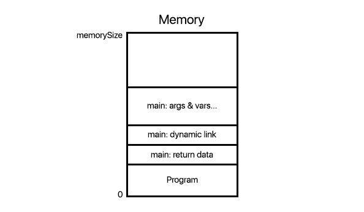

# Introduction

Lorem ipsum

# Storage

We will push activation records for each scope, preducure and function of the program into the runtime stack. Each activation record contains the following words: return data, dynamic link (pointer to the start of the previous record) and then the following arguments and/or variables in that specific scope. The records are in this specific order, meaning the first word in a record is the return data, followed by the dynamic link then the arguments and/or variables. Once the record needs to be used, you simply pop all but the bottom two words. Push the result into the return data and use the dynamic link to go back to the previous record.



Each scope will have an associated lexical level (LL) in reference to the main scope. The main scope has a LL of 0. The display is initialized at display[0] pointing to the head of the main activation record. Note that the dynamic link for this record will be null as it has nowhere to return to. Any initilized variables are also pushed in to the stack, these also act as the global variables within that program.


Suppose we are currently at the lexical level curLL.


If a procedure or function occurs next, we get the address of the top of the stack from the machine (MSP) then set it to the display[curLL+1]. We then set the dynamic link for that record to be display[curLL-1]. We initialize arguments and variables respetive to functions and procedures as before. Note that procedures do not have a return data, thus set the return data to null.


As our programs are sequential, it implies we can use the same activation record for all the minor scopes as they will only refere to variables in sequential order. We will create a record just like before, however, we will not increment the lexical level and thus not create a new display pointer. We will simply give it the same dynamic link as the main scope it is currently sitting in.


## Integer and Boolean Constants, Text Constants

I'm not too sure what they are really asking here. The machine itself tells us how they are represented. Maybe something like this?

>Integers will be stored in the word as is. As the integers have a bound of -32767 to +32767 and the memory is 16 bits, it will align. 


# Expressions

## Constants

Since the constants have been pushed onto stack during parsing the execution. We can simply use POP to access them during the expression evaluation. For example: a != True, PUSH MACHINE_TRUE will be executed when parsing the expression and later we can use POP to access its value

## Scalar variables

Since the code genaration happens after the semantic analysis, we already have a symbol table created for this program. For each scalar variable in the program we can store the lexical level and offset. Then during code generation we can look up into our symbol table and get its lexical level and offset from the table and use ADDR operation to access the scalar variable.

Example: let's say a has been declared as MACHINE_TRUE and stored in our symbol table where its lexical level is 0 and offset is 4. Then we want to execute a == False.

//TODO ADD ACCESS TO SYMBOL TABLE
ADDR 0 4 (get the address of a)
LOAD

## Arrays

Our language only supports one-dimensional array. Then in order to declare an array with bounds, we have to allocate memory for that array. Let's say we have a declared array A[5]. And we want to access A[3]. We already know the base address of the array and then program executes following commands to access A[3]

PUSH 3

PUSH wordsize

MULT

PUSH base_addr

ADD

LOAD

## Arithmetic operations

To do the arithmetic operations, we have to first access the left and right handside of the expression and pop and push them onto the top of the stack. After that we call MULT,DIV,ADD,SUB operators respectively. Example: x declared as 5 and y declared as 2 and assume they have been already accessed and placed on the top of the stack. 

x*y

PUSH X

PUSH Y

MULT

## Comparison operators

We do the same thing as above in the arithmetic operations, access the variables and place them on the top of the stack. Then call LT, EQ to do comparisons. Assume x and y has been declared and placed on the top of stack.

x >= y

push y

push x

LT

push y

push x

EQ

OR

## Boolean operations

Since we do not have a AND instruction, we can use De Morgan's law to replace AND statement with OR.  A and B = neg(neg(A) or neg(B)). Again as above, we access the variables and place them on top of the stack and call appropriate instruction.

A AND B

PUSH A

NEG

PUSH B

NEG

OR 

NEG

## Conditional expressions

For conditional expression, we access the value of conditional expression and place it on top of the stack and compare it with True. If it is an if-else statement, push the address of first instruction in else block and do branch false. If it is an ordinary if statement with an else clause, then place first address of the first instruction after if statement on top of the stack and do branch false.

```
	if a > 5:
	  b = 1
	else:
	  b = 2
```

Let's assume value of a > 5 has been placed on top of the stack

PUSH MACHINE_TRUE

EQ

PUSH addr_else (the address of first instruction in else clause)

BF

# Statements

## assignment statement

For each assignment statement, we will first need to calculate the address of the variable by looking at its enclosing scope's activation record. Each variable inside a scope is assigned an offset, so that inside a contiguous region of memory that contains the all of the scopeo's variables, the address of any given variable can be determined to be the starting address of the region of memory + the particular variable's offset. Since the scope's activation record has all of its variables stored in a contiguous region of memory, we can then easily determine the variable's address in the activation stack to be display[currentLL] + 2 * wordSize + variableOffset. Once that is done, the value (constant or variable) can be stored/pushed to the top of the stack, right before we store the value in the variable.

Example (Assume that variable x has already been declared as an Integer): ```x := 3```

can cause the following machine code to be generated (Note that currentLL will always be a constant/address of the currentLL value that is stored in the memory, and variableOffset is also a constant that determines the position of the given variable inside the variables region of the activation record):

ADDR currentLL 0

PUSH 2

PUSH 16

MUL

ADD 

PUSH variableOffset

ADD

PUSH 3

STORE

## if statements

Each if statement will be composed of 1) a conditional statement, 2) a "then clause" and 3) an "else clause" (in the case that the if statement is actually an if-else statement). In memory, the machine code for the conditional statement will be followed by the code for the "then clause", which will in turn be followed the machine code for the "else clause" (in the case of an if-else statement). 
It is important to note that the address of each and every instruction in the program is known at compile time. During code generation every node in the AST tree will need to be traversed. Although the length of the "then clause" is unknown when the node for the enclosing if statement is first encountered, the generator will nevertheless proceed to examine the then clause's node in a depth first manner before coming back up to its parent node (i.e the if statment's node), at which point the length of the "then clause" will be known.
Therefore the length of the then clause will be known at compile time. If firstAddress is the address of the first instruction belonging to the "then clause" (which is also known at compile time), then we can calculate the address of the first instruction that follows the "then clause" to be firstAddress + length of "then clause"

Example (Assume that variable b has already been declared as an Integer): 
```if (false) then b := 1 else b := 0```

can cause the following machine code to be generated (Note that thenLength is a constant representing the length of the "then clause" that is determined at compile time):

PUSH firstAddress

PUSH thenLength

ADD

PUSH false

BF

## the while and repeat statements
The repeat statement is somewhat similar to an if statement. As the address of each and every instruction in the program is known at compile time, a while statement can be translated to a sequence of instructions for the loop's body followed by a conditional branch that branches to the loop body if the conditional expression evaluates to false.
For a while statement however, the statement's conditional expression is evaluated before any instruction belonging to the loop's body is executed. The evaluation fo the conditional expression is then followed by a conditional branch (i.e BF), so that the program will jump to the first instruction following the while statement if the conditional evalutes to false. The instructions/machine code belonging to the loop body follows the conditional branch, and finally an unconditional branch to the instruction that initially evaluated the conditional expression is added after the loop body.

Example 1: ```repeat b := 1 until false```

can cause the followiong code to be generated (Assume that firstAddr is the address of the first instruction, b has already been declared as an Integer, and the address of variable b has already been calculated and put on top of the stack):

PUSH 1

STORE   % b := 1

PUSH firstAddr % firstAddr is the address of the instruction PUSH 1

PUSH 0

BF

Example 2: ```while true do b := 100```

causes the following code to be generated (Again assume that b has already been declared as an Integer):

PUSH nextStatementAddr      % Address of the first statement that immediately follows the current while statement
                            % is equal to the address of the instruction PUSH nextStatementAddr + total length of while
PUSH 1

BF
% Assume that inside the current activation record's list of variables, variable b's distance from the first variable in the % list is the constant bOffset 
ADDR currentLL 0

PUSH 2

PUSH 16

MUL

ADD 

PUSH bOffset

ADD             % address of b = display[currentLL] + 2 * wordSize + bOffset

PUSH 100

STORE           % b := 100

BR firstAddr    % firstAddr is the address of PUSH nextStatementAddr

## all forms of exit statements

## return statements
In the case of a simple return statement (for a procedure), the size of the current procedure's activation record is first calculated, before the entire record is popped off the stack.
If the return statement returns with an expression however, everything on the activation record except the return value will be popped off the stack.

Example 1 (Assume the following statement is nested inside a procedure): ```return```

generates:
ADDR currentLL 0    % Get the starting address of the activation record

PUSHMT              % Get the address of the top of the stack

SUB                 % Get the difference to calculate the size of the activation record

POPN                % Pop off the activation record

Example 2 (Assume the following statement is nested inside a function): ```return with 1```

generates:

ADDR currentLL 0    % Get the starting address of the activation record

PUSHMT              % Get the address of the top of the stack

SUB                 % Get the difference to calculate the size of the activation record

PUSH 1              % Size of the return value on the activation record

POPN                % Pop off everything on the record except the return value

## 'read' and 'write' statements

During code generation, a 'write' output instruction can result in a mixture of integers and strings being outputted. Due to this fact, output will be converted an ASCII string by the code generator if it is an Integer. Similarly, a character or newline can be represented as '\n' in Unix systems, so any newline character will be converted to the string "\n". This is done so that a sequence of characters, strings, newlines, integers can be treated as a single string by the code generator. Once the entire output argument has been converted into a string, we will be able to print output as a sequence of ASCII characters.

Example 1: ```write "Hello", newline```

generates:

PRINTC

PRINTC

PRINTC

PRINTC

PRINTC

PRINTC

PRINTC

PUSH 110

PUSH 92 

PUSH 111

PUSH 108 

PUSH 108 

PUSH 101 

PUSH 72 

'read' statements only read in Integers, so no ASCII conversions are used for this particular statement. A sequence of inputs will be read in using multiple READI instructions, as shown below. 

Example 2 (Assume a, b have already been declared as Integer variables): ```read a, b```

generates:

ADDR currentLL 0

PUSH 2

PUSH 16

MUL

ADD 

PUSH aOffset 

ADD             % address of a = display[currentLL] + 2 * wordSize + aOffset

READI

STORE 

ADDR currentLL 0

PUSH 2

PUSH 16

MUL

ADD 

PUSH bOffset 

ADD             % address of b = display[currentLL] + 2 * wordSize + bOffset

READI

STORE 

## handling of minor scopes

